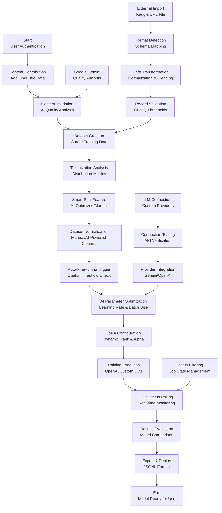

# Bhasha AI Lab : Advanced AI Model Training Platform and cultural preserver

  Bhasha AI Lab is a powerful, comprehensive platform designed by **Bhasha AI Lab** to democratize AI model training for low-resource Indian languages. With its modern interface and advanced feature set, it provides an efficient way to collect linguistic content, create curated datasets, and fine-tune custom AI models while preserving cultural and linguistic diversity.

Live link - https://bharatforge.vercel.app/

## Features

### Core Functionality
- **Multi-Language Support**
  - Hindi, Bengali, Tamil, Telugu, Marathi, Gujarati
  - Kannada, Malayalam, Punjabi, Odia
  - Extensible language framework

- **Content Management Levels**
  1. **Basic (Level 1)**
     - Text content contribution
     - Basic metadata tagging
     - Draft/Published workflow

  2. **Intermediate (Level 2)**
     - Rich metadata (region, dialect, cultural context)
     - AI-powered quality analysis
     - Auto-deduplication (85% similarity threshold)

  3. **Advanced (Level 3)**
     - All features from levels 1 & 2
     - Comprehensive validation (10-10,000 chars, max 2000 tokens)
     - Advanced filtering and search
     - Batch processing capabilities

### Advanced Features
- **Smart Dataset Creation**: AI-powered dataset normalization and cleanup
- **Fine-tuning Pipeline**: Automated model training with parameter optimization
- **Real-time Monitoring**: Live job tracking with progress indicators
- **Custom LLM Integration**: Connect external AI providers
- **External Data Import**: Multi-source data ingestion (Kaggle, URLs, files)
- **Results Comparison**: Model evaluation with BLEU scores and cultural accuracy
- **Dark/Light Theme**: Toggle between themes with persistent preferences
- **Batch Processing**: Process multiple files and datasets simultaneously
- **Progress Tracking**: Real-time progress indication for all operations

## Detailed Feature Specifications

### Smart Split Feature (Latest Addition)
The platform includes an advanced dataset splitting system with two modes:

#### AI-Optimized Split
- **Dataset Size Analysis**: Analyzes total samples and content complexity
- **Optimal Ratio Calculation**: Automatically determines best train/validation/test splits
- **Confidence Scoring**: Provides confidence levels for split recommendations
- **Reasoning Display**: Shows AI reasoning behind split decisions

#### Manual Split Configuration
- **Custom Percentages**: User-defined split ratios with validation
- **Real-time Sample Count**: Live display of actual sample counts per split
- **Constraint Validation**: Ensures minimum samples per split
- **Preview Mode**: Shows split distribution before applying

### Tokenization Analysis Engine
Comprehensive token analysis for all datasets:

#### Distribution Metrics
- **Average Tokens**: Mean token count across dataset
- **Median Tokens**: Middle value for balanced analysis
- **Min/Max Tokens**: Range boundaries for content validation
- **Standard Deviation**: Token count variance analysis
- **Percentile Analysis**: 25th, 50th, 75th, 90th, 95th percentiles

#### Quality Indicators
- **Token Density**: Tokens per character ratio
- **Content Complexity**: Multi-dimensional complexity scoring
- **Language Consistency**: Token pattern analysis per language

### AI Parameter Optimization System
Advanced hyperparameter tuning with intelligent defaults:

#### Dynamic Learning Rate Calculation
- **Dataset Size Factor**: Learning rate scales with dataset size
- **Complexity Adjustment**: Higher complexity = lower learning rate
- **Model Type Consideration**: Different rates for different base models
- **Convergence Prediction**: Optimized for faster convergence

#### Batch Size Optimization
- **Token Variance Analysis**: Batch size adjusts based on token distribution
- **Memory Constraints**: Automatic memory-aware batch sizing
- **GPU Utilization**: Optimizes for hardware capabilities
- **Training Speed**: Balances speed vs. stability

#### LoRA Configuration Engine
- **Dynamic Rank Selection**: Rank 4-64 based on dataset complexity
- **Alpha Parameter Tuning**: Automatically calculated alpha values
- **Model-Specific Optimization**: Different settings per base model
- **Efficiency Metrics**: Optimizes for parameter efficiency

#### Cost & Time Estimation
- **Real-time Cost Calculation**: Live cost estimates during setup
- **Time Prediction**: Estimated training duration
- **Resource Optimization**: Suggests optimal configurations
- **Budget Constraints**: Respects user-defined limits

### Auto-Fine-tuning Pipeline
Seamless automation from dataset to trained model:

#### Trigger Conditions
- **Dataset Creation**: Automatically starts when dataset is ready
- **Quality Thresholds**: Only triggers for high-quality datasets
- **Size Requirements**: Ensures minimum dataset size
- **User Preferences**: Respects user automation settings

#### Automated Workflow
- **Parameter Selection**: Uses AI-optimized parameters
- **Model Selection**: Chooses best base model for dataset
- **Progress Monitoring**: Tracks training automatically
- **Notification System**: Alerts on completion/failure

### Provider Integration Details

#### Google Gemini Integration
- **Quality Analysis**: Advanced content quality scoring
- **Cultural Context**: Language-specific cultural analysis
- **Content Validation**: Automated content verification
- **Bias Detection**: Identifies potential biases in content

#### OpenAI Integration Specifics
- **Live Status Polling**: Real-time job status updates
- **Synchronization**: Automatic status synchronization
- **Error Handling**: Comprehensive error management
- **Retry Logic**: Intelligent retry mechanisms

#### Status Filtering System
- **Job State Filtering**: Filter by pending, running, completed, failed, cancelled
- **Time-based Filtering**: Filter by creation date, completion time
- **User Filtering**: Filter by user, team, or organization
- **Model Filtering**: Filter by base model type

### Data Transformation Pipeline

#### External Import Processing
- **Format Detection**: Automatic recognition of data formats
- **Schema Mapping**: Intelligent field mapping to internal schema
- **Data Validation**: Comprehensive validation pipeline
- **Quality Scoring**: Automated quality assessment

#### Normalization & Cleaning
- **Text Normalization**: Standardizes text formatting
- **Encoding Handling**: Manages various text encodings
- **Duplicate Removal**: Advanced deduplication algorithms
- **Content Filtering**: Removes inappropriate or low-quality content

#### Record Validation System
- **Required Field Validation**: Ensures all mandatory fields present
- **Text Length Validation**: Validates character and token limits
- **Language Detection**: Automatic language identification
- **Quality Thresholds**: Enforces minimum quality standards

## Workflow

The following diagram illustrates the complete workflow of the Culture AI Suite:



This comprehensive workflow demonstrates how Culture AI Suite handles the complete pipeline from content contribution to model deployment, including:

- **Advanced Tokenization Analysis**: Detailed distribution metrics and quality indicators
- **Smart Split Technology**: AI-optimized dataset splitting with confidence scoring
- **Auto-Fine-tuning Pipeline**: Seamless automation from dataset creation to trained model
- **AI Parameter Optimization**: Dynamic learning rates, batch sizes, and LoRA configuration
- **Provider Integration**: Google Gemini quality analysis and OpenAI live status polling
- **Data Transformation**: Comprehensive external import processing with validation
- **Status Management**: Advanced filtering and real-time monitoring capabilities

## Installation

### Prerequisites
- Node.js 18 or higher
- pnpm package manager
- Convex account for backend services

### Step 1: Clone the Repository
```bash
git clone https://github.com/switch41/Nxtwave.git
cd Nxtwave
```

### Step 2: Install Dependencies
```bash
pnpm install
```

### Step 3: Environment Setup
1. Create a `.env` file in the root directory:
```bash
# Convex Configuration
CONVEX_DEPLOYMENT=your_convex_deployment
VITE_CONVEX_URL=your_convex_url

# Authentication (Backend)
JWKS=your_jwks_key
JWT_PRIVATE_KEY=your_jwt_private_key
SITE_URL=your_site_url
```

2. Set up Convex authentication:
```bash
chmod +x set-convex-jwt-env.sh
./set-convex-jwt-env.sh
```

### Step 4: Start Development Server
```bash
pnpm dev
```

## Usage

### Basic Usage
1. Launch the application:
   ```bash
   pnpm dev
   ```

2. Navigate to `/auth` for authentication
3. Choose authentication method (Email OTP or Anonymous)
4. Access the dashboard at `/dashboard`

### Content Management
1. Navigate to `/content/new` to add linguistic content
2. Fill in required metadata (language, region, category)
3. Submit for AI quality analysis (optional)
4. Review and publish content

### Dataset Creation
1. Go to `/datasets/create`
2. Select content using advanced filters
3. **Tokenization Analysis**: View detailed metrics (avg, median, min, max, stdDev, percentiles)
4. Choose normalization mode (Manual/AI-Powered)
5. **Smart Split Configuration**: Configure train/validation/test splits with AI optimization
6. Export in JSONL format

### Fine-tuning Process
1. Navigate to `/finetune/new`
2. Select base model (OpenAI GPT-3.5/GPT-4 or Custom LLM)
3. **Smart Split Configuration**:
   - Choose AI-Optimized Split for automatic ratio calculation
   - Or use Manual Split with custom percentages
   - View real-time sample counts and confidence scores
4. **AI Parameter Optimization**:
   - Review AI-suggested learning rates and batch sizes
   - Configure LoRA rank (4-64) and alpha parameters
   - View cost and time estimates
5. Start training and monitor progress at `/finetune/:id`
6. **Auto-Fine-tuning**: Enable automatic training upon dataset creation

### External Data Import
1. Click "External Import" from dashboard
2. Select data source (Kaggle, URL, or file upload)
3. **Data Transformation Pipeline**:
   - Automatic format detection and schema mapping
   - Comprehensive validation pipeline
   - Text normalization and encoding handling
   - Advanced deduplication algorithms
4. Configure field mapping
5. **Record Validation**: Required fields, text/token length, quality thresholds
6. Run validation pipeline
7. Create dataset automatically with quality scoring

### Custom LLM Integration
1. Go to `/llm-connections`
2. Add new connection with API details
3. Test connection
4. Use in fine-tuning pipeline

## Security Features

### Authentication & Authorization
- Email OTP authentication
- Anonymous guest access
- Role-based access control (Admin, User, Member)
- Activity logging and audit trails

### Data Protection
- Secure content validation
- Quality scoring with AI analysis
- Duplicate detection and prevention
- Comprehensive error handling
- Real-time data synchronization

### Privacy & Compliance
- User activity tracking
- Secure API integrations
- Data export capabilities
- Configurable access controls

## Troubleshooting

### Common Issues
1. **Convex Connection Errors**:
   - Verify environment variables
   - Check Convex deployment status
   - Ensure proper authentication setup

2. **Authentication Issues**:
   - Clear browser cache
   - Verify email OTP delivery
   - Check JWT configuration

3. **Fine-tuning Failures**:
   - Validate dataset format
   - Check API key permissions
   - Verify model availability

4. **Performance Issues**:
   - Optimize dataset size
   - Use batch processing
   - Monitor resource usage

## Contributing

We welcome contributions! Please follow these steps:

1. Fork the repository
2. Create a feature branch (`git checkout -b feature/amazing-feature`)
3. Commit your changes (`git commit -m 'Add amazing feature'`)
4. Push to the branch (`git push origin feature/amazing-feature`)
5. Create a Pull Request

### Development Guidelines
- Follow TypeScript best practices
- Use Shadcn UI components
- Implement mobile-responsive design
- Add Framer Motion animations
- Include proper error handling
- Write comprehensive tests

## Tech Stack

### Frontend
- **React 19** with TypeScript
- **Vite** for build tooling
- **Tailwind CSS v4** for styling
- **Shadcn UI** component library
- **Framer Motion** for animations
- **React Router v7** for navigation
- **Three.js** for 3D graphics

### Backend
- **Convex** real-time serverless backend
- **Convex Auth** for authentication
- **Cron jobs** for automated tasks
- **Internal actions** for background processing

### AI Integrations
- **OpenAI** (GPT-3.5, GPT-4) with live status polling and synchronization
- **Google Gemini** for advanced quality analysis and cultural context
- **Custom LLM** provider support with automatic provider inference
- **LoRA** fine-tuning optimization with dynamic rank and alpha configuration
- **Smart Split Technology** with AI-optimized dataset splitting
- **Auto-Fine-tuning Pipeline** with seamless automation

## Database Schema

The application uses 11 Convex tables:
- `users`: User accounts and roles
- `content`: Linguistic content entries
- `datasets`: Curated training datasets
- `finetune_jobs`: AI model training jobs
- `test_prompts`: Model evaluation prompts
- `activities`: User activity logs
- `llm_connections`: Custom LLM integrations
- `external_datasets`: Imported external data
- `import_pipelines`: Data import workflows
- `field_mappings`: Field mapping templates

## Application Routes

- `/` - Landing page with project overview
- `/auth` - Authentication (sign in/sign up)
- `/dashboard` - Main dashboard with analytics
- `/content` - Content browser and management
- `/content/new` - Add new linguistic content
- `/content/:id` - Edit existing content
- `/datasets` - Dataset browser and management
- `/datasets/create` - Create new dataset
- `/finetune` - Fine-tuning jobs list
- `/finetune/new` - Start new fine-tuning job
- `/finetune/:id` - Monitor specific job
- `/results/:id` - Compare model results
- `/llm-connections` - Manage LLM connections
- `/external-import` - Import external datasets

## License

This project is licensed under the MIT License - see the [LICENSE](LICENSE) file for details.

## Acknowledgments

- **Convex** for real-time backend infrastructure
- **OpenAI** for AI model APIs
- **Google Gemini** for quality analysis
- **Shadcn UI** for component library
- **Framer Motion** for animation framework
- **React community** for the ecosystem

## Support

For support, please:
1. Check the troubleshooting guide above
2. Review existing issues on GitHub
3. Create a new issue with detailed information
4. Contact the development team

## Research Documentation

For comprehensive information about low-resource language AI training and cultural preservation in AI models, please refer to our research documentation. This provides detailed insights into the challenges of training AI models for Indian languages and how Culture AI Suite addresses these limitations.

## Contributors

* **Bhasha AI Lab Team**
* **Nxtwave x GPT Buildathon Participants**
* **Open Source Community Contributors**

---

Made with ❤️ for preserving linguistic diversity through AI

**Culture AI Suite** - Empowering communities to build AI models for their languages
